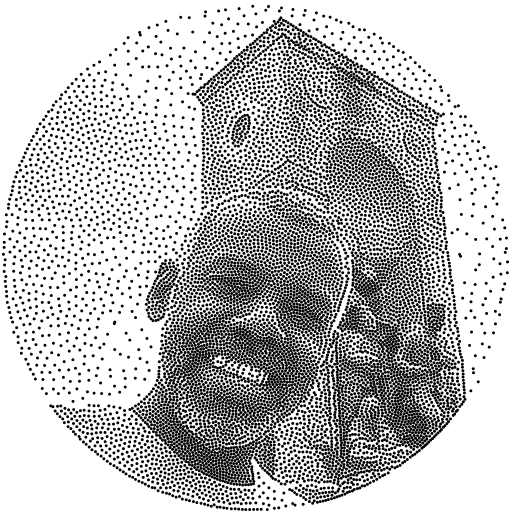

# GaussianBlueNoise
This is a windows compilation of [Gaussian Blue Noise (ACM TOG 2022)](https://abdallagafar.com/publications/gbn/).

To compile on windows, I had to find a windows build of cairo (included), and a windows replacement for "getopt". I also had to make a couple small changes to the code.  [compile.bat](compile.bat) was used to compile the code, and requires [CUDA](https://developer.nvidia.com/cuda-downloads).

More work may be needed to make all utilities work with all options, but it works for what I need it for, and I'm sharing those results. Feel free to report problems, or submit fixes if you hit any!

See readme.txt for more information about the changes, as well as example command line parameters from the author.

This utility creates very high quality blue noise point sets - much better than dart throwing, mitchell's best candidate, sliced optimal transport, lloyd relaxation, or thresholding a blue noise texture.

Please see [Serial Gaussian Blue Noise Stippling (Eurographics 2024)](https://doi.org/10.2312/cgvc.20241226) for further advancements on this work.

## Example:

`./gbn-adaptive taksim-circle.pgm 10000 1000 taksim-circle.png taksim-circle.txt`

Create 10,000 points, using the image **taksim-circle.pgm** as a point density distribution, and use 1,000 steps of iteration. This took 7.5 seconds to run on my machine.

Saves the points as plain text in [taksim-circle.txt](taksim-circle.txt), and taksim-circle.png.

Note: pgm files can be viewed and saved by [GIMP](https://www.gimp.org/downloads/). When exporting from gimp as a .pgm file, choose ASCII instead of Raw to get a text pgm instead of a binary one.  You also need to open the file in a text editor and remove the line near the top that begins with "# Created by GIMP....". Leaving that comment in seems to make the pgm loading code hang.

